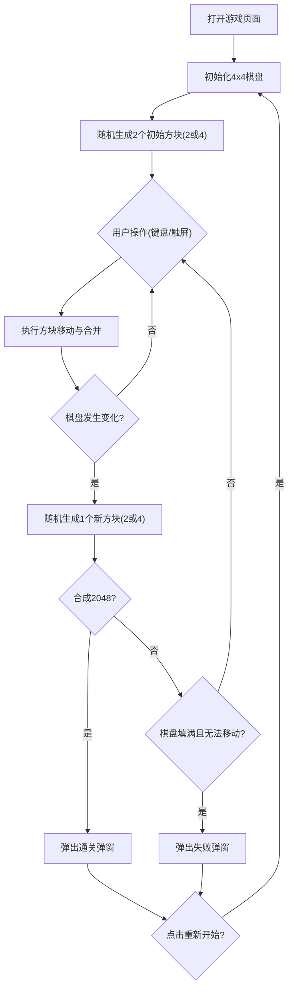

## 1. 产品概述

2048是一款经典数字益智游戏，玩家通过滑动操作使相同数字的方块合并，目标是合成2048。本产品支持PC键盘和移动端触屏双操作，本地存储最高分记录。

- 主要目标：提供一款体验流畅、视觉精美的2048小游戏，兼容桌面和移动设备
- 目标用户：休闲游戏爱好者，碎片化时间消遣用户

## 2. 核心功能

### 2.1 用户角色
无需注册登录，所有用户均可直接游玩。

### 2.2 功能模块
1. **游戏主界面**：4x4棋盘、分数显示、最高分显示、新游戏按钮
2. **游戏核心逻辑**：方块生成、移动合并、得分计算、胜负判定
3. **操作系统**：键盘方向键（PC）、触摸滑动（移动端）
4. **弹窗系统**：通关弹窗、游戏结束弹窗
5. **数据持久化**：本地存储最高分

### 2.3 页面详情
| 页面名称 | 模块名称 | 功能描述 |
|---------|---------|---------|
| 游戏主页面 | 标题区 | 显示游戏名称"2048"和副标题 |
| 游戏主页面 | 分数区 | 实时显示当前分数和历史最高分 |
| 游戏主页面 | 控制区 | 新游戏按钮、操作说明 |
| 游戏主页面 | 棋盘区 | 4x4方块棋盘，显示数字方块及动画 |
| 游戏主页面 | 通关弹窗 | 合成2048时弹出，显示得分和重新开始按钮 |
| 游戏主页面 | 失败弹窗 | 棋盘填满且无法移动时弹出，显示最终得分和重新开始按钮 |

## 3. 核心流程

用户打开页面 → 自动初始化游戏（生成2个初始方块）→ 用户通过键盘或触屏进行滑动操作 → 方块移动并合并相同数字 → 空白格随机生成新方块 → 判定游戏状态（进行中/通关/失败）→ 若通关或失败则弹出对应弹窗 → 用户可选择重新开始

## 4. 用户界面设计

### 4.1 设计风格
- **主色调**：暖橙色系 (#f2b179 为方块2的底色，逐步加深至 #edc22e 为2048)，棋盘背景为深米色 (#bbada0)
- **按钮风格**：圆角矩形，深色背景配白色文字，悬停有微动效
- **字体**：使用现代无衬线字体，数字加粗显示，字号根据数字大小自适应
- **布局风格**：居中卡片式布局，棋盘为核心视觉焦点，分数区位于顶部
- **动画效果**：方块生成时缩放弹出动画，合并时放大闪烁动画，移动时平滑过渡

### 4.2 页面设计概述
| 页面名称 | 模块名称 | UI元素 |
|---------|---------|--------|
| 游戏主页面 | 标题区 | 大号"2048"标题，右侧显示分数面板 |
| 游戏主页面 | 分数区 | 两个圆角卡片，分别显示"SCORE"和"BEST"及对应数值 |
| 游戏主页面 | 控制区 | "新游戏"按钮 + 简短玩法说明文字 |
| 游戏主页面 | 棋盘区 | 4x4网格，每个格子根据数字显示不同背景色和文字颜色，数字越大颜色越亮 |
| 游戏主页面 | 弹窗 | 半透明遮罩 + 居中白色卡片，包含标题、分数、按钮，带有淡入动画 |

### 4.3 响应式设计
- 桌面优先设计，移动端自适应
- 棋盘尺寸根据屏幕宽度自动调整，最小不低于240px
- 移动端按钮和可点击区域保证≥44px触摸尺寸
- 禁止移动端页面缩放，确保滑动操作流畅
- 触摸滑动支持四方向检测，带有滑动防抖防止误触

## 4.4 视觉细节
- 方块阴影增加立体感
- 数字根据位数自动调整字号（2-3位数较大，4位数稍小）
- 背景采用渐变或轻微纹理增强质感
- 弹窗遮罩使用半透明深色背景
