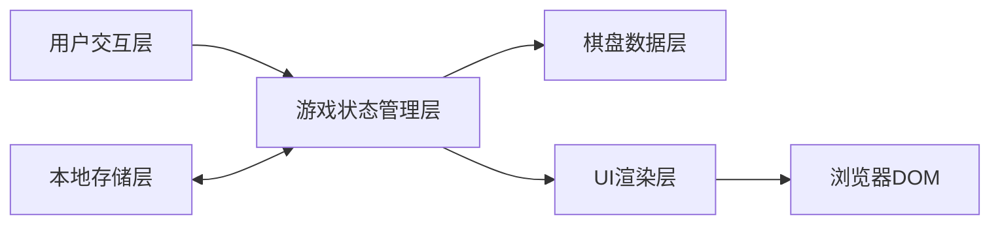

## 1. 架构设计



## 2. 技术描述
- **前端框架**：React@18 + TypeScript
- **构建工具**：Vite
- **样式方案**：TailwindCSS@3
- **状态管理**：Zustand
- **本地存储**：localStorage API
- **无需后端**：纯前端单页应用

## 3. 目录结构

```
src/
├── components/
│   ├── Board.tsx          # 棋盘组件
│   ├── Tile.tsx           # 方块组件
│   ├── ScorePanel.tsx     # 分数面板
│   ├── GameOverModal.tsx  # 游戏结束弹窗
│   └── WinModal.tsx       # 通关弹窗
├── hooks/
│   ├── useGame.ts         # 游戏核心逻辑Hook
│   └── useTouch.ts        # 触屏滑动Hook
├── utils/
│   └── gameLogic.ts       # 游戏算法工具函数
├── types/
│   └── game.ts            # 类型定义
├── store/
│   └── gameStore.ts       # Zustand状态管理
├── App.tsx
├── main.tsx
└── index.css
```

## 4. 核心数据模型

### 4.1 类型定义

```typescript
// 单个方块
interface Tile {
  id: number;          // 唯一标识
  value: number;       // 数字值(2,4,8,...,2048)
  row: number;         // 行位置 0-3
  col: number;         // 列位置 0-3
  isNew?: boolean;     // 是否新生成
  isMerged?: boolean;  // 是否刚合并
}

// 棋盘状态 4x4
type Board = (Tile | null)[][];

// 游戏状态
interface GameState {
  board: Board;
  score: number;
  bestScore: number;
  gameStatus: 'playing' | 'won' | 'over';
}

// 移动方向
type Direction = 'up' | 'down' | 'left' | 'right';
```

### 4.2 游戏算法

**移动与合并逻辑**（以向左移动为例）：
1. 对每一行进行处理
2. 提取该行所有非空方块
3. 从左到右遍历，相邻相同数字合并（每个方块每轮最多合并一次）
4. 合并后的数字累加到分数
5. 剩余空位填充null
6. 四个方向逻辑类似，通过旋转棋盘复用同一套算法

**胜负判定**：
- 胜利：任意方块value === 2048
- 失败：棋盘无空位 且 无相邻相同数字可合并

**新方块生成**：
- 在所有空格子中随机选一个
- 90%概率生成2，10%概率生成4

## 5. 交互处理

### 5.1 键盘操作
- 监听 `keydown` 事件
- 支持 ArrowUp, ArrowDown, ArrowLeft, ArrowRight
- 阻止默认滚动行为

### 5.2 触屏操作
- 监听 `touchstart`, `touchend`, `touchmove` 事件
- 计算滑动向量 `(deltaX, deltaY)`
- 根据绝对值较大的方向判定滑动方向
- 设置最小滑动距离阈值（如30px）防抖

## 6. 动画方案

- **方块移动**：CSS transition on transform/position
- **新方块生成**：CSS keyframes 缩放弹出动画 (scale 0→1)
- **合并动画**：CSS keyframes 先放大再回原尺寸 (pop 效果)
- 所有动画使用 TailwindCSS 自定义动画配置
